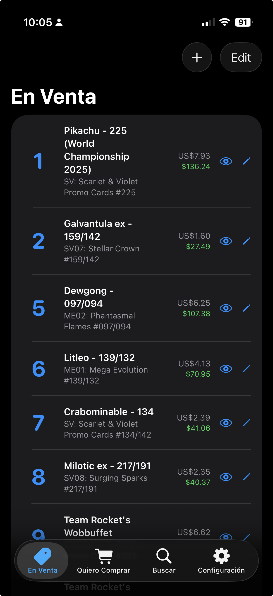
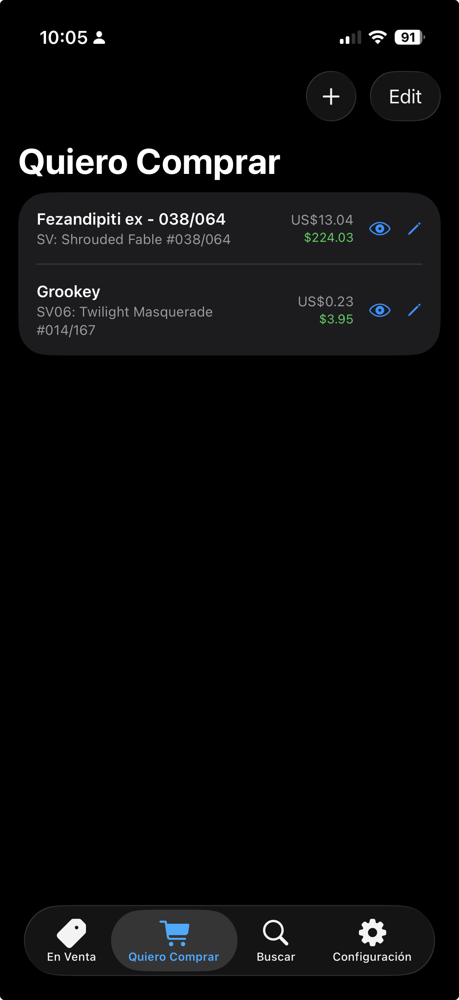
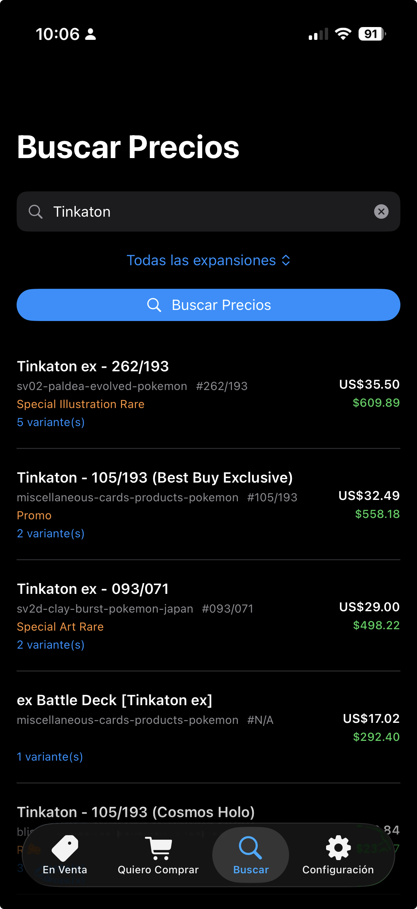
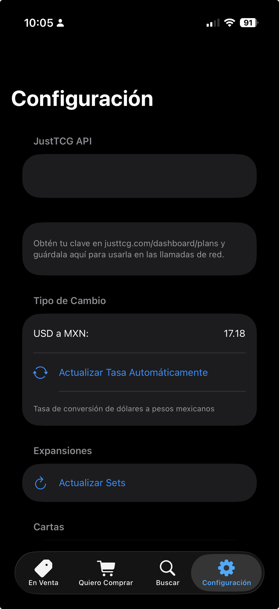

# 🃏 PokéPrices

A native iOS app to track Pokémon TCG card prices, manage your collection for sale, keep a wishlist of cards you want to buy, and quickly look up market prices — all powered by the [JustTCG API](https://justtcg.com).


---

## ✨ Features

### 🏷️ Cards for Sale
Manage a list of cards you own and want to sell. Each card shows its current market price in **USD** and **MXN**.

### 🛒 Want to Buy
Keep a separate wishlist of cards you're looking to purchase, with the same search and detail capabilities.

### 🔍 Quick Price Search
Look up any card by name, optionally filter by expansion, and instantly see prices — no need to save anything. Perfect for checking prices on the fly at a trade table.

### ⚙️ Settings
- Configure your JustTCG API key
- Auto-update USD → MXN exchange rate
- Refresh expansion/set data from the API
- Bulk-update prices for all your saved cards

### 📱 Additional Features
- **NFC Deep Linking** — Scan NFC tags with `ogl://card?id=X` URLs to jump directly to a card's details
- **Card Variants** — View prices for different conditions (Near Mint, Lightly Played, etc.) and printings (Normal, Reverse Holo, etc.)
- **Thumbnail Previews** — Card images from the API displayed throughout the app
- **Dual Currency** — All prices shown in both USD and MXN with configurable exchange rate

---

## 📸 Screens

| En Venta | Quiero Comprar | Buscar Precios | Configuración |
|:--------:|:--------------:|:--------------:|:-------------:|
|  |  |  |  |

---

## 🛠️ Requirements

- **Xcode 16+**
- **iOS 18.0+**
- **Swift 6.0**
- A [JustTCG API key](https://justtcg.com/dashboard/plans) (free tier available)

---

## 🚀 Getting Started

### 1. Clone the repo

```bash
git clone https://github.com/psyrax/pokePrices.git
cd pokePrices
```

### 2. Open in Xcode

```bash
open Prices.xcodeproj
```

Or if you prefer building from the command line:

```bash
# Build for simulator
xcodebuild -project Prices.xcodeproj -scheme Prices -destination 'platform=iOS Simulator,name=iPhone 16' build

# Build for device
xcodebuild -project Prices.xcodeproj -scheme Prices -destination 'generic/platform=iOS' -allowProvisioningUpdates build
```

### 3. Run

Select your target device or simulator in Xcode and hit **⌘R**, or install to a connected device via CLI:

```bash
# Find your device ID
xcrun xctrace list devices

# Install
xcrun devicectl device install app --device <DEVICE_ID> \
  ~/Library/Developer/Xcode/DerivedData/Prices-*/Build/Products/Debug-iphoneos/Prices.app
```

### 4. Configure

On first launch, go to the **Configuración** tab and:
1. Paste your **JustTCG API Key**
2. Tap **Actualizar Sets** to download all Pokémon TCG expansions
3. Optionally tap **Actualizar Tasa Automáticamente** to get the current USD→MXN rate

---

## 📁 Project Structure

```
Prices/
├── PricesApp.swift          # App entry point & deep link handling
├── MainTabView.swift        # Tab bar (En Venta, Quiero Comprar, Buscar, Config)
├── ContentView.swift        # "For Sale" card list
├── WantToBuyListView.swift  # "Want to Buy" wishlist
├── SearchView.swift         # Quick price lookup
├── SettingsView.swift       # App configuration
├── CartaEditView.swift      # Card editor with API search
├── CartaDetailView.swift    # Full card detail with variants
├── CardSelectionView.swift  # Card picker from search results
├── Carta.swift              # Card data model (SwiftData)
├── CartaVariant.swift       # Card variant model (conditions/printings)
├── PokemonSet.swift         # Game set model (SwiftData)
├── CartaService.swift       # JustTCG API client
├── CurrencyService.swift    # Exchange rate service
├── SampleData.swift         # Preview sample data
└── Item.swift               # Legacy item model
```

---

## 🔗 NFC Deep Linking

The app supports the custom URL scheme `ogl://card?id=X` for NFC tag integration. Write this URL to an NFC tag and scan it to jump directly to a card's detail view.

See [NFC_DEEP_LINKING.md](NFC_DEEP_LINKING.md) for setup details.

---

## 📄 License

This project is open source and available under the [MIT License](LICENSE).
